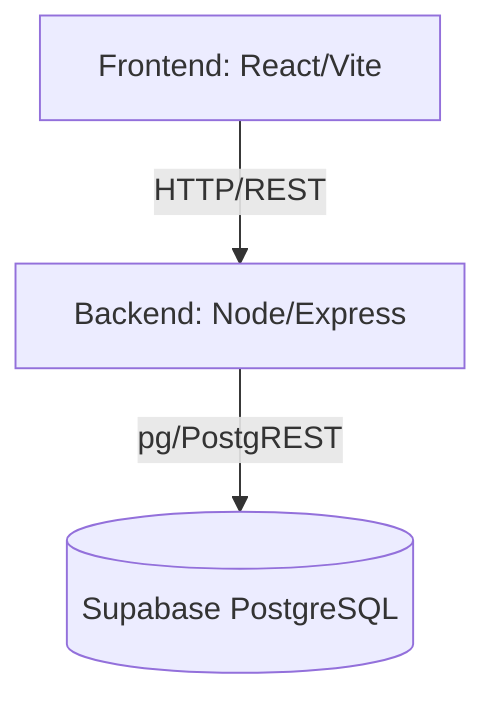

# Architecture Blueprint

## 1. System Architecture

## 2. Tech Stack
- **Frontend:** React (TypeScript), Vite, Tailwind CSS (Mobile-First), Lucide React
- **Backend:** Node.js, Express.js
- **Database:** Supabase (PostgreSQL)
- **Deployment:** Docker Compose
  - `frontend`: Nginx static server
  - `backend`: Node runtime

## 3. Critical Technical Decisions
- **Auth Strategy:** Frontend ส่ง Token/SSO Email ให้ Backend, Backend ตรวจสอบสิทธิ์และดึงข้อมูลจาก Supabase ผ่าน Service Role Key
- **State Management:** React `useState` & Context API (MVP stage)
- **Monorepo Layout:** Polyrepo in one folder (`/frontend`, `/backend` แยก package.json กัน)
