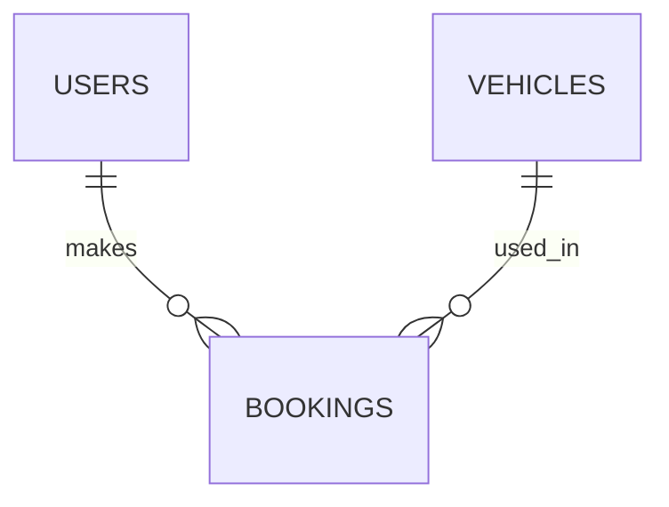

# Database Schema & Type Definitions

## 1. ER Diagram


## 2. Core TypeScript Interfaces (Frontend)
```typescript
export type UserRole = 'admin' | 'executive' | 'project_lead' | 'tracking_officer' | 'vehicle_admin';

export interface User {
  id: string;
  name: string;
  role: UserRole;
  title: string;
  department: string;
  email: string;
}

export interface VehicleBooking {
  id: number;
  booking_date: string;
  start_time: string;
  end_time: string;
  vehicle_type: 'Van' | 'Pickup' | '6-Wheel';
  booker: string;
  driver: string;
  purpose: string;
  destination: string;
  passengers: string;
  status: 'Pending' | 'Confirmed' | 'Completed' | 'Cancelled';
  admin_officer: string;
  vehicle_id: number | null;
  mileage_start: number;
  mileage_end: number;
  total_distance: number;
}
```

## 3. Database Security
- ควบคุมสิทธิ์การเข้าถึงผ่าน Backend Middleware (ตรวจสอบ Role) 
- Supabase ใช้ Service Role Key ฝั่ง Backend (ซ่อนผ่าน .env)
